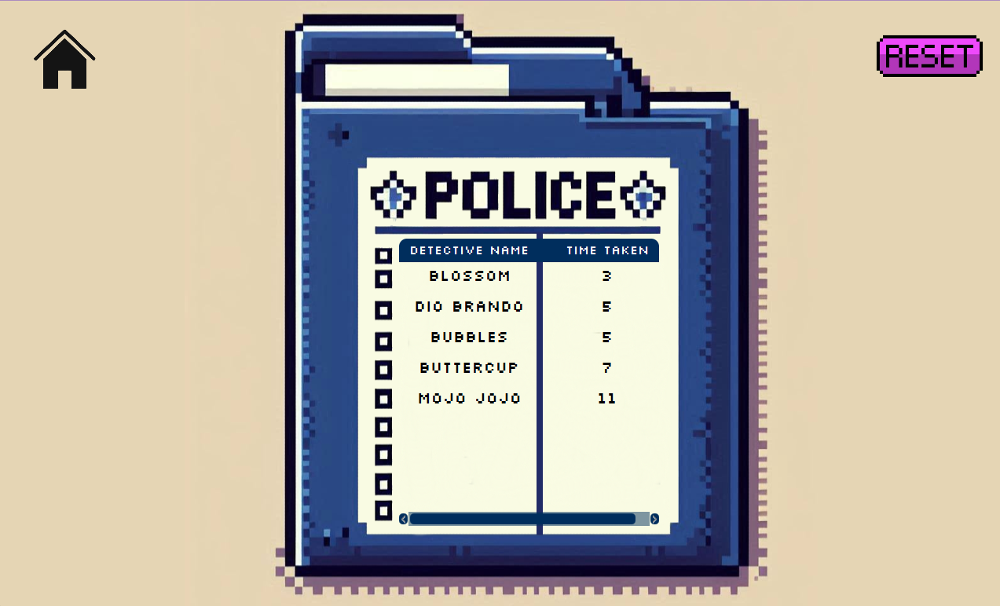

# Sneaky Thief Game

Welcome to **Sneaky Thief Game**, a Scala-based game designed using basic Object-Oriented Programming (OOP) principles. The game leverages the **ScalaFX** and **Java 8** libraries to create an engaging and interactive experience.

## 🕹️ Gameplay

In this game, players take on the role of a sharpshooter with the mission to shoot/click on the animated, moving thief while avoiding other dynamic hostages. The goal is to deplete the thief's health bar before the timer runs out.

### Key Features:
1. **Target the Thief:** Use your mouse to click on the moving thief. Each successful hit reduces the thief's health.
2. **Avoid Hostages:** Hostages are also moving around the screen. Accidentally shooting a hostage will be a loss.
3. **Time Challenge:** You must defeat the thief before the timer runs out, adding an exciting race against the clock.

## 🎬 Story Introduction

Before the action starts, players are introduced to the game through a short, animated dialog scene that sets the stage for the game. This scene not only introduces the storyline but also provides instructions on how to control the gameplay.

## 🕵️‍♂️ Detective Board

After each game, the names of players and the time they took to defeat the thief are stored in a database. This information is then displayed on the Detective Board screen, showcasing the top detectives who have successfully captured the thief.

### Detective Board Features:
- **Player Names:** The names of players who successfully captured the thief are stored.
- **Time Taken:** The time taken to defeat the thief is recorded and displayed, allowing players to see how they rank against others.
- **Reset Button:** Deletes/Clears all records on the database.
- **Home Button:** Returns player back to menu screen.

## 🛠️ Technologies Used

- **Scala**: The primary programming language used to develop the game.
- **ScalaFX**: A Scala wrapper for JavaFX, used to create the user interface.
- **Java 8**: Required for running ScalaFX and for its compatibility with the libraries used in the game.

## 🚀 How to Run the Game

1. Ensure you have **Java 8** and **Scala** installed on your system.
2. Clone this repository to your local machine.
3. Run the MainApp.scala file
4. Have Fun!
